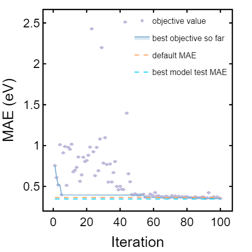
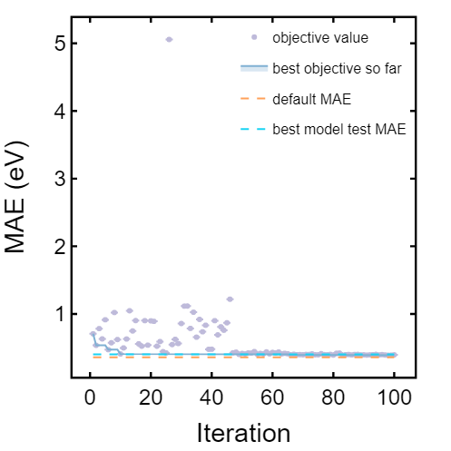
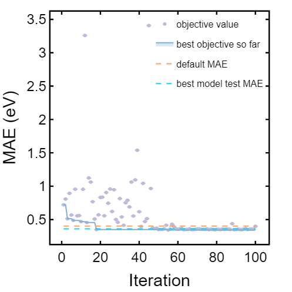
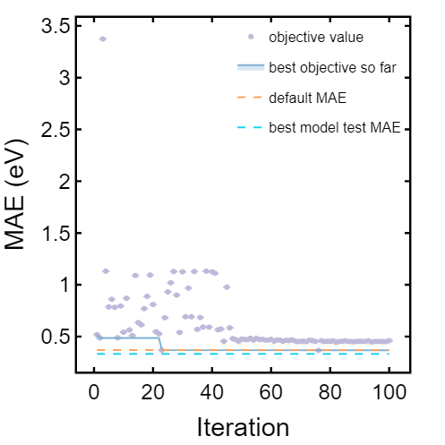
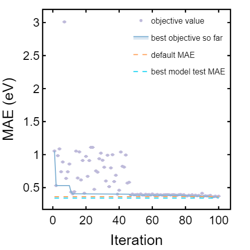

Plots of the Ax hyperparameter optimization. Click on the corresponding link (e.g. best_objective_plot_0.html) for interactive viewing.

## Outer Fold 0
[best_objective_plot_0.html](https://sparks-baird.github.io/crabnet-hyperparameter/figures/best_objective_plot_0.html)

## Outer Fold 1
[best_objective_plot_1.html](https://sparks-baird.github.io/crabnet-hyperparameter/figures/best_objective_plot_1.html)

## Outer Fold 2
[best_objective_plot_2.html](https://sparks-baird.github.io/crabnet-hyperparameter/figures/best_objective_plot_2.html)

## Outer Fold 3
[best_objective_plot_3.html](https://sparks-baird.github.io/crabnet-hyperparameter/figures/best_objective_plot_3.html)

## Outer Fold 4
[best_objective_plot_4.html](https://sparks-baird.github.io/crabnet-hyperparameter/figures/best_objective_plot_4.html)

<!---
Outer fold 0
------------

.. raw:: html
   :file: best_objective_plot_0.html

Outer fold 1
------------

.. raw:: html
   :file: best_objective_plot_1.html

Outer fold 2
------------

.. raw:: html
   :file: best_objective_plot_2.html

Outer fold 3
------------

.. raw:: html
   :file: best_objective_plot_3.html
   
Outer fold 4
------------

.. raw:: html
   :file: best_objective_plot_4.html
--->
